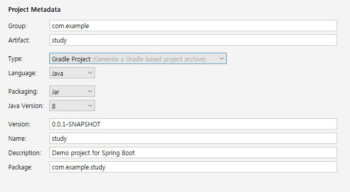
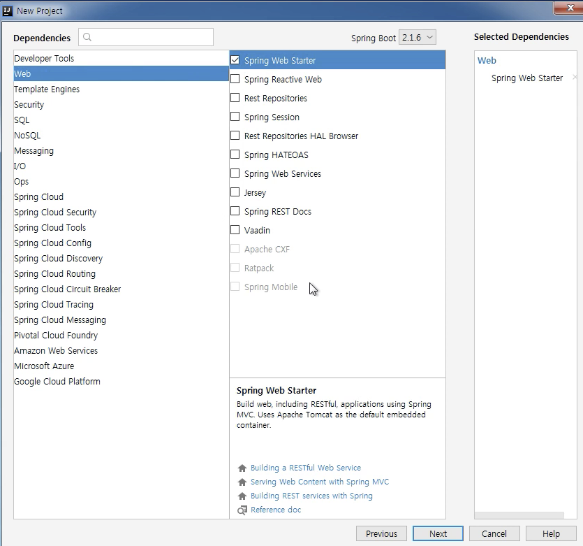
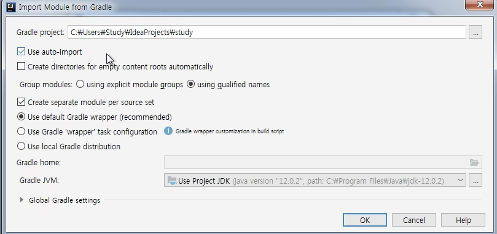

# 개발환경 세팅 - Intellji 와 MySQL 설치

Created: Sep 21, 2020
Status: Done
회차: 2

## Intellij 세팅

- 이클립스에서 플러그인을 많이 설치하면 느려지므로 좀 더 개선된 Intellij 사용(유료)
- 참고 사이트: [https://aileen93.tistory.com/147](https://aileen93.tistory.com/147)
- Create New Project
    1. 설정

        

    2. 어떤 플러그인을 만들 때 자동으로 Gradle 파일에 import 시켜주는 역할이 있는데, 

        우리는 Web > Spring WEb Starter

        

    3. 추가적인 세팅

    - [x]  use auto-import
    - [x]  use default Gradle wrapper (recommended)

    

## MySQL 데이터베이스 사용

- 설치 사이트: [https://dev.mysql.com/downloads/mysql/](https://dev.mysql.com/downloads/mysql/)
