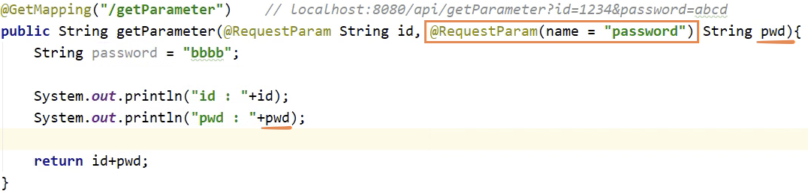

# Rest API

Created: Sep 21, 2020
Status: Done
회차: 4, 5

## 1. HTTP - GET Method

- 주소창에 parameter 노출
- 메서드에 대해서 두 주소가 같다면, spring boot는 실행을 시키지 못함. (메서드 단위에서는 불가능, 클래스 단위에서는 가능)
- 브라우저에서 주소에 대한 캐시가 이루어지므로, 정보를 얻을 때 사용

    ### 예제 1) Basic

    

    - 7th: @RestController
    - 8th: @RequestMapping("/${path}")
        - API 주소를 mapping 하기 위한 annotation  + 어떠한 주소로 받을지에 대한 path 지정

            ```java
            @RequestMapping("/${path}")   // localhost:8080/api 
            ```

    - 11th: @RequestMapping(method, path)
        - request mapping을 통해서 method는 어떠한 타입으로 받을 건지, path는 어떠한 주소로 받을 건지

            ```java
            	@RequestMapping(method = RequestMethod.GET, path = "/getMethod")    // localhost:8080/api/getMethod
            ```

    - 결과

        

        

    ### 예제 2) Single Parameter (1,2개)

    

    - 15th: @GetMapping("/{path}")
        - RequestMapping과는 다르게 주소만 설정해 주면 됨

            ```java
            @GetMapping("/getParameter")     // localhost:8080/api/getParameter?id=1234&password=abcd
            ```

    - 16th: @RequestParam
        - 요청한 parameter를 받기 위해 사용

            ```java
            @RequestParam String id, @RequestParam String password
            ```

        - 이미 로컬 함수에 해당 변수명이 있는 경우: @RequestParam(name = "password")

            

    ### 예제 3) Multiple Parameter

    

    - parameter가 많은 경우 객체를 생성하여 getter, setter 메서드를 만듦.
    - 객체를 사용할 때는 @RequestParam annotation을 쓰지 않음.
    - jackson library 로 인해 객체를 return하면 자동적으로 **json으로 변환**이 되어서 return 이 됨.

---

## 2. HTTP - POST Method

- 주소창에 parameter 노출 없음.
- Get 방식에는 주소 길이 제한이 있지만, POST 방식에는 그보다 더 길게 가능(길이 제한은 있음)
- 브라우저가 주소 캐시를 하지 못하는 특성이 있음.

    

- 17th: 아래 두 코드는 동일한 것을 의미

    ```java
    @RequestMapping(method = RequestMethod.POST, path = "/postMethod")
    ```

    ```java
    @PostMapping("/postMethod")
    ```

- 18th: @RequestBody
    - http post body에 데이터를 넣어 매칭 시켜 줌.
- default는 Json이지만 다른 type이면 아래 produces에 어떠한 방식으로 받을지 지정할 수 있음.

    ```java
    @PostMapping("/postMethod", produces = {"application-json"})
    ```

- 결과
    - 구글 확장 프로그램
        - 변경 전: (Restlet Client - REST API Testing) → 변경 후: (Talend API Tester - Free Edition)


---

## 3. HTTP - PUT/PATCH Method

- POST 와 마찬가지로 BODY에 데이터가 있으며, 주로 업데이트를 요청함.


---

## 4. HTTP - DELETE Method

- GET 과 마찬가지로 parameter로 동작하며, 주로 삭제를 요청함.

---

## *따라서, REST API 란?*

### REST의 개념

- HTTP 프로토콜에 있는 Method를 활용한 아키텍처 스타일
- HTTP method를 통해서 resource를 처리하는 것임.
- CRUD를 통해서 resource를 조작할 때 사용함.

[REST](https://www.notion.so/8a82600d1cb3421090559c92dff8f663)

중요한 것은 어떻게 URL에서 데이터를 꺼내올 것이며, 어떻게 다시 웹 사이트에 return 할 것인가 이다.
