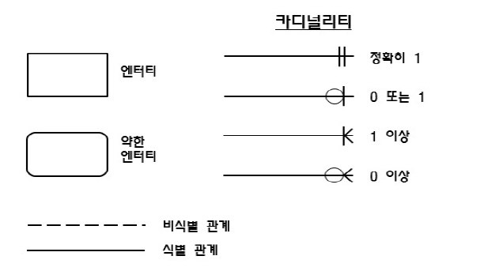
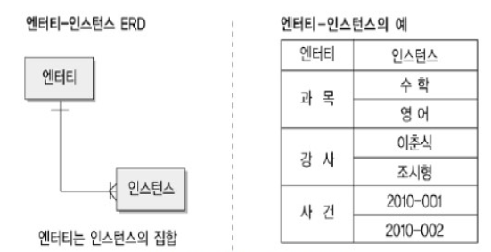

## 1-1. 데이터 모델링의 이해

 

### 제 1절. 데이터 모델의 이해

##### 데이터 모델링의 중요성 및 유의점

- 중복: 같은 시간 같은 데이터 제공
- 비유연성: 사소한 업무 변화에 데이터 모델이 수시로 변경되면 안 됨
- 비일관성: 데이터 간 상호 연관 관계에 대해 명확히 정의 필요


#####  데이터 모델링

개념적, 논리적, 물리적 데이터 모델링


#####  데이터 독립성 요소

- 외부 스키마: 사용자가 보는 개인적 DB 스키마
- 개념 스키마: 모든 사용자 관점을 통합한 전체 DB
- 내부 스키마: 물리적 장치에서 데이터가 실제적 저장


##### 데이터 독립성

- 논리적 독립성: 개념스키마 변경. 외부 스키마 영향 X
- 물리적 독립성: 내부 스키마 변경. 외부, 개념 스키마 영향 X


#####  Mapping(사상)

- 상호 독립적인 개념을 연결시켜주는 다리
- 외부 스키마 - (논리적사상) - 개념스키마 - (물리적사상) - 내부스키마


#####  데이터 모델링의 3요소

- Things: 어떤 것
- Attributes: 성격
- Relationships: 관계


##### 데이터 모델 표기법

- 1976년 피테첸이 Entity Relationship Model 개발
- IE, Baker 기법이 많이 쓰임
- 엔터티, 관계, 속성으로 이뤄짐


##### ERD 작업순서

1. Entity 그림
2. Entity 배치
3. Entity 관계 설정
4. 관계명 기술
5. 관계의 참여도 기술
6. 관계필수여부




##### 좋은 데이터 모델의 요소

1. 완전성: 업무에 필요한 모든 데이터가 모델에 정의
2. 중복배제: 하나의 DB내에 동일한 사실은 한 번만
3. 업무규칙: 많은 규칙을 사용자가 공유하도록 제공
4. 데이터 재사용: 데이터가 독립적으로 설계되어야 함
5. 의사소통: 업무규칙은 엔터티, 서브타입, 속성, 관계 등의 형태로 최대한 자세히 표현
6. 통합성: 동일한 데이터는 한 번만 정의, 참조 활용

---

### 제 2절. 엔터티

#####  엔터티

- 업무에 필요하고 유용한 정보를 저장하고 관리하기 위한 집합적인 것

- 보이지 않는 개념 포함

  

- 특징
  1. 반드시 해당 업무에서 필요하고 관리하고자 함
  2. 유일한 식별자에 의해 식별 가능
  3. 두개 이상의 인스턴스의 집합
  4. 업무 프로세스에 의해 이용되어야 함
  5. 반드시 속성이 있어야 함
  6. 다르 엔터티와 최소 1개 이상의 관계가 있어야 함
     - 통계성/코드성 엔터티는 관계 생략 가능


##### 엔터티의 분류

- 유무형에 따른 분류: 유형, 개념, 사건 엔터티
  - 유형: 물리적 형태
    - ex) 사원, 물품, 강사
  - 개념: 개념적 정보
    - ex) 조직, 보험상품
  - 사건: 업무 수행시 발생
    - ex) 주문, 청구, 미납

- 발생시점에 따른 분류: 기본/키, 중심, 행위 엔터티
  - 기본: 그 업무에 원래 존재하는 정보, 타 엔터티의 부모 역할, 자신의 고유한 주식별자를 가짐
    - ex) 사원, 부서
  - 중심: 기본 엔터티로부터 발생, 다르 엔터티와의 관계로 많은 행위 엔터티 생성
    - ex) 계약, 사고, 주문
  - 행위: 2개 이상의 부모 엔터티로부터 발생, 자주 바뀌거나 양이 증가
    - ex) 주문 목록, 사원변경이력


##### 엔터티의 명명

- 현업업무에서 사용하는 용어 사용
- 약어 사용금지
- 단수명사 사용
- 고유한 이름 사용
- 생성 의미대로 부여


---

### 제 3절. 속성

#####  속성

- 업무에서 필요로하는 인스턴스로 관리하고자 하는 의미상 분리되지 않는 ```최소의 데이터``` 단위
  - 한 개의 엔터티는 2개 이상의 인스턴스 집합
  - 한 개의 엔터티는 2개 이상의 속성을 가짐
  - 한 개의 속성은 1개의 속성값을 가짐


##### 구성 방식의 분류

- PK, FK, 일반 속성

  

##### 속성의 분류

- 기본: 업무로부터 추출한 모든 일반적인 속성
- 설계: 업무를 규칙화하기 위해 새로 만들거나 변형, 정의하는 속성
  - ex) 일련번호
- 파생: 다른 속성에 영향을 받아 발생하는 속성. 빠른 성능을 낼 수 있도록 원래 속성의 값을 계산, 적을 수록 좋음
  - ex) 합


##### 도메인

- 속성에 대한 타입, 크기, 제약사항, 지정


##### 속성의 명명

1. 해당 업무에서 사용하는 이름 부여
2. 서술식 속성명 사용 금지
3. 약어 사용 금지
4. 구체적으로 명명하여 데이터 모델에서 ```유일성``` 확보


---

### 제 4절. 관계

##### 관계

- 엔터티의 인스턴스 사이의 논리적인 연관성으로서 존재의 형태로서나 행위로서 서로에게 연관성이 부여된 상태
- 관계 페어링의 집합
  - ex) 강사 - 가르친다(관계) - 수강생


##### 페어링

- 엔터티 안에 인스턴스가 개별적으로 관계를 가지는 것


##### UML(통합모델링언어)에서의 관계

- 연관관계(실선): 항상 이용하는 관계
  - ex) 소속된다.
- 의존관계(점선): 상대 행위에 의해 발생하는 관계
  - ex) 주문한다.


##### 관계의 표기법

- 관계명: 관계의 이름
- 관계차루: 1:1, 1:M, M:N
- 관계선택성(관계선택사양): 필수관계, 선택관계


##### 관계 체크사항

1. 2개의 엔터티 사이에 관심있는 **연관 규칙**이 있는가?
2. 2개의 엔터티 사이에 **정보의 조합**이 발생하는가?
3. 업무기술서, 장표에 **관계연결**에 대한 규칙이 **서술**되어있는가?
4. 업무기술서, 장표에 **관계연결**을 가능케하는 **동사**가 있는가?


---

### 제 5절. 식별자

##### 식별자

- 엔터티 내에서 인스턴스를 구분하는 구분자
- 식별자는 논리적, key는 물리적 데이터 모델링 단계에 사용


##### 식별자의 특징

- **유일성**: 주식별자에 의해 모든 인스턴스들이 유일하게 구분
- **최소성**: 주식별자를 구성하느느 속성의 수는 유일성을 만족하는 최소의 수가 되어야 함
- **불변성**: 지정된 주식별자의 값은 자주 변하지 않아야 함. 변하면 이전 기록 말소됨
- **존재성**: 주식별자가 지정되면 반드시 값이 들어와야 함


##### 식별자의 분류

- 대표성 여부
  - 주식별자
    - 엔터티 내에서 각 어커런스(정확성)을 구분할 수 있는 구분자
    - 타 엔터티와 참조관계를 연결시킴
  - 보조식별자
    - 구분자이나 대표성이 없고, 참조관계를 연결 없음
- 스스로생성여부
  - 내부식별자: 스스로 생성되는 식별자
  - 외부식별자: 타 엔터티로부터 받아오는 식별자


##### 속성의 수

- 단일식별자: 하나의 속성으로 구성
- 복합식별자: 2개 이상의 속성으로 구성


##### 대체여부

- 본질식별자: 업무에 의해 만들어지는 식별자
- 인조식별자: 인위적으로 만든 식별자


##### 주식별자 도출기준

1. 해당 업무에서 자주 이용되는 속성
2. 명칭, 내역 등과 같이 이름으로 기술되는 것들은 X
3. 복합으로 주식별자로 구성할 경우 너무 많은 속성 X

  => 너무 많으면 인조식별자 생성하기


##### 식별자 관계

1. 주식별자

   - 자식의 주식별자로 부모의 주식별자 상속
   - 부모로부터 받은 식별자를 자식엔터티의 주식별자로 이용하는 경우
   - 강한 연결관계 표현 / 실선 표기 ㅡ

   - 식별자 관계로만 설정 시 주식별자 증가로 오류 유발

2. 비식별자

   - 부모 속성을 자식의 일반 속성으로 사용
     1. 부모 없는 자식이 생성될 수 있는 경우
     2. 부모와 자식의 생명주기가 다른 경우(별도로 소멸)
     3. 여러 개의 엔터티가 하나의 엔터티로 통합되어 표현되었는데 각자의 엔터티가 별도의 관계를 가진 경우
     4. 자식 엔터티에 별도의 주식별자를 생성하는 것이 더 유리한 경우
     5. SQL 문장이 길어져 복잡성 증가되는 것을 방지
   - 약한 연결관계 표현 / 점선 표기 - - - 
   - 비식별자 관계로만 설정 시 부모 엔터티와 조인하여 성능 저하

