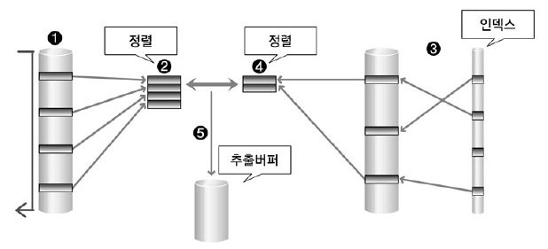

# 2-3. SQL 최적화 기본 원리

### 제 1절. 옵티마이저와 실행 계획

##### 옵티마이저

- 다양한 실행방법 중 최적의 방법을 결정

##### 옵티마이저 분류

1. 규칙 기반 옵티마이저

   - **규칙 1. Single row by rowid**
     - rowid로 하나의 행을 액세스
   - **규칙 4. Single row by unique or primary key**
     - 유일 인덱스로 하나의 행을 액세스
   - **규칙 8. Composite index**
     - 복합 컬럼 인덱스에 동등 연산자로 검색
   - **규칙 9. Single column index**
     - 단일 컬럼 인덱스에 동등 연산자로 검색
   - **규칙 10. Bounded range search on indexed columns**
     - 인덱스가 형성되어 있는 컬럼에 양쪽 범위를 한정하여 검색
   - **규칙 11. Unbounded range search on indexed columns**
     - 인덱스가 형성되어 있는 컬럼에 한쪽 범위를 한정하여 검색
   - **규칙 15. Full table scan**
     - 전체 테이블 액세스(WHERE절 읽으면서)

   

   :arrow_forward: 우선순위대로 나열. 규칙 1이 우선순위 제일 높음

   

2. 비용 기반 옵티마이저

   (질의 변환기)  :arrow_right: (대안 계획 생성기) :arrow_left: (비용 예측기)

##### 실행 계획

- SQL에서 요구한 사항을 처리하기 위한 절차와 방법을 의미 실행계획을 구성하는 요소에는 

  - 조인순서(Join Order)

  - 조인기법(Join Method)

  - 엑세스 기법(Access Method)

  - 최적화 정보(Optimization Information)

  - 연산(Operation) 

    등이 있다.

    

---

### 제 2절. 인덱스 기본

- DML 작업은 테이블과 인덱스를 모두 변경 > 느려질 수 있음

##### 종류

1) **트리기반** 인덱스(Oracle)
2) **클러스터형** 인덱스(SQL Server)

##### 테이블 액세스 방법

1. **전체 테이블 스캔**: 테이블의 대부분인 Data를 엑세스하는 것에 유리
2. 인덱스 스캔
   1. 인덱스 유일 스캔: 유일 인덱스로 단일행에 액세스
   2. 인덱스 범위 스캔: 인덱스로 다중행을 액세스
   3. 인덱스 역순 범위 스캔 

---

### 제 3절. 조인 수행 원리

- **조인이란 두 개 이상의 테이블을 하나의 집합으로 만드는 연산**
- SQL 문에서 FROM 절에 두 개 이상의 테이블이 나열될 경우 조인이 수행됨.
- 조인 연산은 두 테이블 사이에서 수행됨.
- 만일 FROM 절에 A, B, C 테이블을 조인할 경우, A,B를 먼저 조인하고 그 결과와 C를 조인하게 되는 과정을 거침 
- 각 조인을 수행할 때 기법을 달리하여 수행 가능
- 대표적인 조인 기법 세가지
  - NL Join
  - Sort Merge Join
  - Hash Join

##### 1. NL Join

- 랜덤 방식으로 데이터를 액세스

- 추출버퍼(=운반단위, Array Size, Prefetch Size)는 SQL문의 실행 결과를 보관하는 버퍼

- 동작원리

  1. 선행 테이블에서 주어진 조건을 만족하는 행을 찾음

  2. 선행 테이블의 조인 키 값을 가지고 후행 테이블에서 조인 수행

  3. 선행 테이블의 조건을 만족하는 모든 해엥 대해 1번 작업 반복 수행

     

##### 2. Sort Merge Join

- NL Join은 랜덤 액세스 방식, **Sort Merge Join은 스캔 방식**

- 대량의 조인 작업은 CPU 작업 위주로 처리하는 Hash Join이 성능상 유리

- Hash Join과는 달리 동등 조인 뿐만 아니라 비동등 조인에 대해서 조인 작업 가능

- 조인 컬럼의 인덱스가 존재하지 않아도 사용 가능

  ​	

##### 3. Hash Join

- Hash Join은 해쉬 기법을 이용하여 조인 수행
- Hash Join은 NL Join의 랜덤 액세스 문제점과 Sort Merge Join의 문제점인 정렬 작업의 부담을 해결
- **동등 조인에서만 사용 가능**

- 먼저 해쉬 테이블을 생성하는 선행 테이블(Build Input), 해쉬 테이블에 대해 해쉬 값의 존재 여부를 검사하는 후행 테이블(Prove Input)으로 이루어짐

  